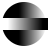

# CloudControl

A Minimalist, Cloud-Based, Multi-User UAS Control Station.

<!-- Link to Mavlink -->
Depends on [a currently out-of-tree dialect](https://github.com/DanielAdelodun/mavlink/tree/stemstudios) of the MAVLink communication protocol.
And [MAVSDK-Python](https://github.com/mavlink/MAVSDK-Python)

I run tests here: [adelodun.uk](https://adelodun.uk).
See demos [here](https://www.youtube.com/playlist?list=PLUynPy3uH59Gy0MrNPr-RNbP1IAcMRKa2).

Example nginx configuriation here. Requests to the `/ws` url path must be routed to `MavlinkWebSockServer`.